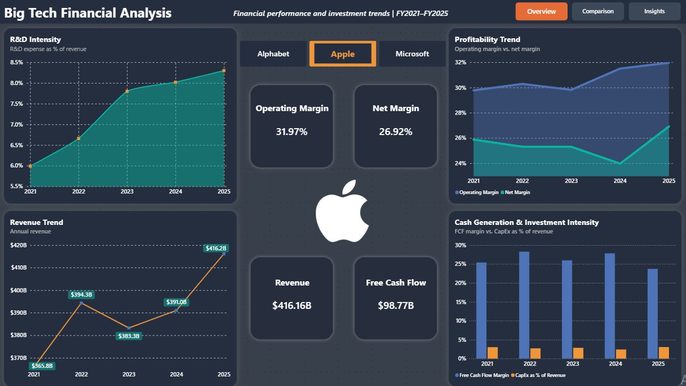
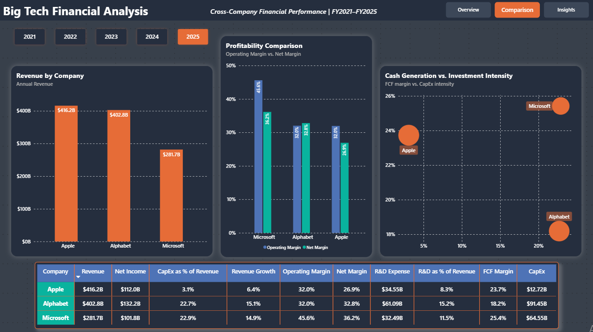
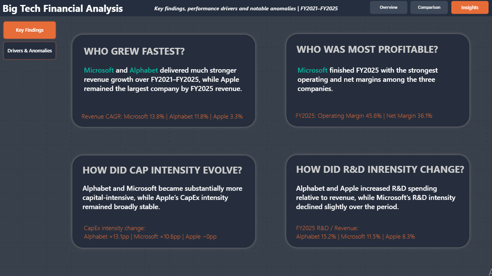
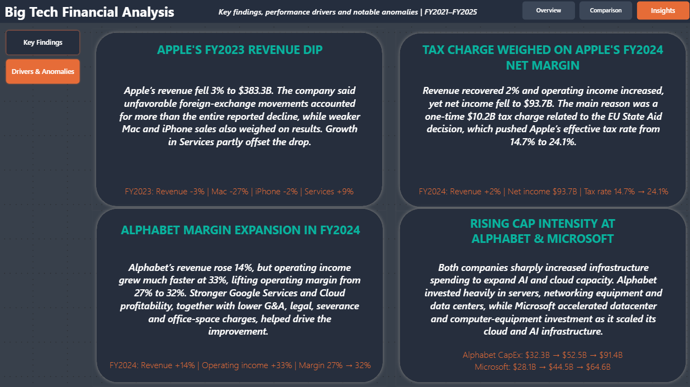

# Big Tech Financial Analytics

An end-to-end financial analytics project comparing **Apple, Microsoft, and Alphabet** using SEC filing data, Python, and Power BI.

The project builds a reproducible pipeline that retrieves annual financial data from the SEC Company Facts API, calculates key financial performance indicators, and presents the results through an interactive Power BI dashboard.

## Project Highlights

- Reproducible Python pipeline using the SEC Company Facts API
- Financial analysis of Apple, Microsoft, and Alphabet across FY2021–FY2025
- Interactive three-page Power BI report with dynamic filtering, logos, bookmarks, etc.
- Analysis of revenue growth, profitability, R&D intensity, cash generation, and capital investment
- Filing-backed investigation of notable financial anomalies and performance drivers

## Dashboard Preview

### Executive Overview



### Company Comparison



### Key Findings



### Drivers & Anomalies



---

## Project Objective

The goal of this project is to analyze and compare the financial performance of three major technology companies across FY2021–FY2025.

The analysis focuses on four areas:

- Revenue growth
- Profitability
- Research and development intensity
- Cash generation and capital investment

The project also investigates notable financial movements and uses company filings to provide context for unusual changes in the data.

---

## Business Questions

The analysis was designed to answer questions such as:

- How has revenue evolved across Apple, Microsoft, and Alphabet?
- Which company achieved the strongest revenue growth?
- How have operating and net margins changed over time?
- How has R&D intensity evolved?
- Which companies became more capital-intensive?
- How efficiently are the companies converting revenue into free cash flow?
- What explains notable changes such as Apple's FY2023 revenue decline?
- How do the three companies compare in a selected fiscal year?

---

## Key Findings

### Revenue Growth

Microsoft and Alphabet recorded substantially stronger revenue growth over FY2021–FY2025 than Apple.

**Revenue CAGR**

- Microsoft: **13.8%**
- Alphabet: **11.8%**
- Apple: **3.3%**

Apple nevertheless remained the largest of the three by FY2025 revenue.

### Profitability

Microsoft finished FY2025 with the strongest profitability metrics among the three companies.

- Operating Margin: **45.6%**
- Net Margin: **36.1%**

### R&D Intensity

Alphabet and Apple increased research and development spending relative to revenue over the analyzed period, while Microsoft's R&D intensity declined slightly.

FY2025 R&D as a percentage of revenue:

- Alphabet: **15.2%**
- Microsoft: **11.5%**
- Apple: **8.3%**

### Capital Intensity

Alphabet and Microsoft became substantially more capital-intensive as investment in cloud and AI infrastructure accelerated.

Change in CapEx as a percentage of revenue across the analysis period:

- Alphabet: **+13.1 percentage points**
- Microsoft: **+10.6 percentage points**
- Apple: approximately unchanged

---

## Notable Drivers & Anomalies

### Apple Revenue Decline in FY2023

Apple's revenue fell approximately 3% in FY2023.

The company reported that unfavorable foreign-exchange movements accounted for more than the entire reported decline, while weaker Mac and iPhone sales also weighed on revenue. Growth in Services partly offset the decrease.

### Apple Net Margin Pressure in FY2024

Apple's revenue recovered in FY2024, but net income declined.

A major factor was a one-time tax charge related to the EU State Aid decision, which significantly increased the company's effective tax rate.

### Alphabet Margin Expansion in FY2024

Alphabet's revenue increased strongly in FY2024, while operating income grew considerably faster.

Improved Google Services and Cloud profitability, together with lower administrative, legal, severance, and office-related costs, contributed to operating-margin expansion.

### Rising Capital Intensity at Alphabet and Microsoft

Alphabet and Microsoft sharply increased capital expenditure as both companies expanded cloud and AI infrastructure.

Investment included data centers, servers, networking equipment, and other computing infrastructure required to support growing AI workloads.

---

## Power BI Report

The Power BI report contains three primary analytical views.

### 1. Executive Overview

Designed for exploring one selected company across FY2021–FY2025.

Features include:

- Dynamic company selector
- Dynamically changing company logos
- Latest-year KPI cards
- Revenue trend
- Profitability trend
- R&D intensity
- Free-cash-flow and CapEx analysis
- Customized tooltips

### 2. Company Comparison

Designed for comparing Apple, Microsoft, and Alphabet within a selected fiscal year.

Includes:

- Fiscal-year selector
- Revenue comparison
- Operating and net margin comparison
- Cash-generation vs. investment scatter analysis
- Financial comparison matrix

### 3. Key Insights

Summarizes the main analytical conclusions.

A bookmark navigator switches between:

- **Key Findings**
- **Drivers & Anomalies**

This separates broad financial conclusions from explanations of unusual movements in the underlying data.

---

## Data Pipeline

The project uses Python to retrieve and transform financial data from the SEC Company Facts API.

The pipeline:

1. Fetches SEC XBRL Company Facts data
2. Extracts annual observations from 10-K filings
3. Validates reporting periods
4. Checks for duplicate or restated observations
5. Standardizes financial metrics across companies
6. Calculates derived KPIs
7. Exports analysis-ready CSV files for Power BI

The pipeline currently produces:

```text
data/processed/
├── company_kpis.csv
├── financial_metrics_long.csv
└── company_logos.csv
```

---

## Financial Metrics

### Base Metrics

- Revenue
- Operating Income
- Net Income
- Research & Development Expense
- Operating Cash Flow
- Capital Expenditure

### Derived KPIs

- Operating Margin
- Net Margin
- Revenue Growth
- Free Cash Flow
- Free Cash Flow Margin
- R&D as % of Revenue
- CapEx as % of Revenue

---

## Power BI Data Model

The report uses shared company and fiscal-year dimensions to filter the financial fact tables consistently.

```text
Dim Company
     │
     ├──── company_kpis
     ├──── financial_metrics_long
     └──── company_logos

Dim Year
     │
     ├──── company_kpis
     └──── financial_metrics_long
```

This structure allows company and year filters to propagate consistently across report visuals.

---

## Project Structure

```text
big-tech-financial-analytics/
│
├── assets/
│   ├── alphabet.png
│   ├── apple.png
│   └── microsoft.png
│
├── data/
│   └── processed/
│       ├── company_kpis.csv
│       ├── company_logos.csv
│       └── financial_metrics_long.csv
│
├── docs/
│   └── images/
│       ├── overview.png
│       ├── comparison.png
│       ├── findings.png
│       └── drivers.png
│
├── notebooks/
│   └── 01_sec_api_exploration.ipynb
│
├── powerbi/
│   └── big_tech_financial_analysis.pbix
│
├── src/
│   ├── create_logo_table.py
│   ├── pipeline.py
│   └── sec_data.py
│
├── .gitignore
├── README.md
└── requirements.txt
```

---

## Technologies

- **Python**
- **pandas**
- **requests**
- **Jupyter Notebook**
- **SEC Company Facts API**
- **Power BI**
- **DAX**
- **Power Query**
- **Git**
- **GitHub**

---

## Reproducing the Project

Clone the repository:

```bash
git clone https://github.com/arminBM/big-tech-financial-analytics.git
cd big-tech-financial-analytics
```

Create a virtual environment:

```bash
python -m venv .venv
```

Activate it in Windows PowerShell:

```powershell
.venv\Scripts\Activate.ps1
```

Install the required packages:

```bash
pip install -r requirements.txt
```

The SEC requires API requests to identify the application and provide contact information.

Set the SEC User-Agent environment variable before running the pipeline:

```powershell
$env:SEC_USER_AGENT="big-tech-financial-analytics <your email>"
```

Run the pipeline:

```bash
python src/pipeline.py
```

The processed datasets will be generated in:

```text
data/processed/
```

The Power BI report is available at:

```text
powerbi/big_tech_financial_analysis.pbix
```

---

## Data Sources

Financial statement data is sourced from the **U.S. Securities and Exchange Commission (SEC)** through the Company Facts / XBRL API.

Company annual reports and Form 10-K filings were also reviewed to investigate and explain notable financial movements.

---

## Limitations

- Financial reporting structures and fiscal-year calendars differ between companies.
- XBRL concepts are not always identical across issuers, requiring concept validation and fallback handling.
- The analysis focuses on annual financial statements rather than quarterly market performance.
- Geographic revenue analysis was not included because the companies disclose geographic information at different levels of detail.
- Financial performance metrics alone do not capture all factors affecting company valuation or future operating performance.

---

## Author

**Armin Bayat**

International Business student interested in financial analytics, business intelligence, data analysis, and automation.